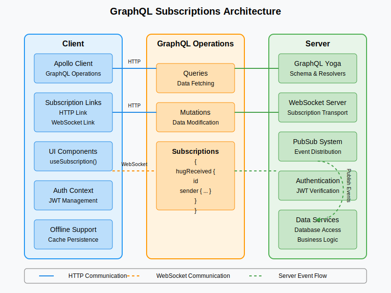

# GraphQL Subscriptions Implementation Guide

## Overview

This guide provides a detailed implementation approach for using GraphQL subscriptions as a replacement for traditional WebSockets in the HugMood application. GraphQL subscriptions provide a standardized way to handle real-time updates within the GraphQL protocol, eliminating the need for a separate WebSocket implementation.

## What Are GraphQL Subscriptions?

Subscriptions are a GraphQL feature that allows a server to send data to clients when specific events occur. Unlike queries and mutations that follow a request-response model, subscriptions establish a persistent connection where the server can push updates to clients in real-time.

## Advantages Over Traditional WebSockets

| GraphQL Subscriptions | Traditional WebSockets |
|------------------------|------------------------|
| Strongly typed schema | Ad-hoc message format |
| Integrates with existing GraphQL infrastructure | Requires separate protocol design |
| Client-specified data requirements | Server determines what data to send |
| Leverages GraphQL validation and security | Custom validation and security needed |
| Unified client implementation | Separate implementation for WebSockets |
| Built-in filtering and authorization | Custom implementation required |

## Architecture Overview



### Core Components:

1. **GraphQL Server**: Apollo Server or GraphQL Yoga with subscription support
2. **PubSub System**: In-memory or Redis-based event publisher/subscriber
3. **WebSocket Transport**: Underlying transport for subscription data
4. **Client Implementation**: Apollo Client or similar with subscription support

## Server-Side Implementation

### 1. Setting Up the Schema

Define subscription types in your GraphQL schema:

```graphql
type Subscription {
  # User-related subscriptions
  userStatusChanged(userId: ID): User
  
  # Mood-related subscriptions
  moodUpdated(userId: ID): MoodEntry
  streakUpdated(userId: ID): StreakInfo
  
  # Hug-related subscriptions
  hugReceived: Hug
  hugRequestReceived: HugRequest
  groupHugUpdated(groupHugId: ID): GroupHug
  
  # Friend-related subscriptions
  friendRequestReceived: FriendRequest
  
  # Notification subscriptions
  notificationReceived: Notification
}
```

### 2. Setting Up the Subscription Server

Using GraphQL Yoga (recommended for modern subscription support):

```javascript
import { createServer } from 'node:http';
import { createYoga } from 'graphql-yoga';
import { createSchema } from 'graphql-tools';
import { useServer } from 'graphql-ws/lib/use/ws';
import { WebSocketServer } from 'ws';
import { PubSub } from 'graphql-subscriptions';

// Create PubSub instance
const pubsub = new PubSub();

// Create schema
const schema = createSchema({
  typeDefs,
  resolvers: {
    Query: { /* query resolvers */ },
    Mutation: { /* mutation resolvers */ },
    Subscription: {
      moodUpdated: {
        subscribe: (_, { userId }) => {
          // If userId is provided, filter for that specific user
          return pubsub.asyncIterator(['MOOD_UPDATED'], {
            filter: userId ? 
              (payload) => payload.moodUpdated.userId === userId :
              () => true
          });
        }
      },
      hugReceived: {
        subscribe: (_, __, context) => {
          // Only send events to the recipient
          const userId = context.user?.id;
          if (!userId) throw new Error('Authentication required');
          
          return pubsub.asyncIterator(['HUG_RECEIVED'], {
            filter: (payload) => payload.hugReceived.recipientId === userId
          });
        }
      },
      // Other subscription resolvers...
    }
  }
});

// Create Yoga instance
const yoga = createYoga({
  schema,
  context: async ({ request }) => {
    // Extract token from headers
    const token = request.headers.get('authorization')?.split(' ')[1] || '';
    
    // Verify and get user if token is valid
    let user = null;
    if (token) {
      try {
        user = await verifyToken(token);
      } catch (error) {
        // Token invalid, user remains null
      }
    }
    
    return {
      user,
      pubsub
    };
  },
  graphiql: {
    subscriptionsProtocol: 'WS' // Enable WebSocket protocol in GraphiQL
  }
});

// Create HTTP server
const httpServer = createServer(yoga);

// Set up WebSocket server for subscriptions
const wsServer = new WebSocketServer({
  server: httpServer,
  path: yoga.graphqlEndpoint
});

// Use the schema with the WebSocket server
useServer(
  {
    schema,
    context: async (ctx) => {
      // Extract token from connection params
      const token = ctx.connectionParams?.authorization || '';
      
      // Verify and get user if token is valid
      let user = null;
      if (token) {
        try {
          user = await verifyToken(token);
        } catch (error) {
          // Token invalid, user remains null
        }
      }
      
      return {
        user,
        pubsub
      };
    },
    onConnect: async (ctx) => {
      // Optional: Perform additional validation on connection
      const token = ctx.connectionParams?.authorization;
      if (!token) {
        // Allow anonymous connections but they won't receive protected data
        console.log('Anonymous connection established');
        return true;
      }
      
      try {
        await verifyToken(token);
        return true;
      } catch (error) {
        // Reject connection if token is invalid
        console.error('Invalid token on subscription connection');
        return false;
      }
    }
  },
  wsServer
);

// Start server
httpServer.listen(4000, () => {
  console.log('Server is running on http://localhost:4000/graphql');
});
```

### 3. Publishing Events

When mutations occur, publish events to the appropriate subscription channels:

```javascript
const Mutation = {
  createMoodEntry: async (_, { input }, { user, dataSources, pubsub }) => {
    // Ensure user is authenticated
    if (!user) throw new AuthenticationError('You must be logged in');
    
    // Create mood entry in database
    const moodEntry = await dataSources.moodsAPI.createMoodEntry({
      ...input,
      userId: user.id
    });
    
    // Publish event for subscriptions
    pubsub.publish('MOOD_UPDATED', { 
      moodUpdated: moodEntry 
    });
    
    // Check if we should publish streak updates
    const streak = await dataSources.streaksAPI.updateMoodStreak(user.id);
    if (streak.milestoneReached) {
      pubsub.publish('STREAK_UPDATED', {
        streakUpdated: streak
      });
    }
    
    return moodEntry;
  },
  
  sendHug: async (_, { input }, { user, dataSources, pubsub }) => {
    // Ensure user is authenticated
    if (!user) throw new AuthenticationError('You must be logged in');
    
    // Create hug in database
    const hug = await dataSources.hugsAPI.createHug({
      senderId: user.id,
      recipientId: input.recipientId,
      type: input.type,
      message: input.message,
      customization: input.customization
    });
    
    // Publish event for subscription
    pubsub.publish('HUG_RECEIVED', { 
      hugReceived: hug 
    });
    
    // Also create a notification
    const notification = await dataSources.notificationsAPI.createNotification({
      userId: input.recipientId,
      type: 'HUG_RECEIVED',
      title: 'New Hug Received',
      body: `${user.displayName || user.username} sent you a ${input.type} hug`,
      data: { hugId: hug.id }
    });
    
    pubsub.publish('NOTIFICATION_RECEIVED', {
      notificationReceived: notification
    });
    
    return hug;
  }
  
  // Other mutation resolvers...
};
```

### 4. Scaling with Redis PubSub

For production environments with multiple server instances, replace the in-memory PubSub with Redis PubSub:

```javascript
import { RedisPubSub } from 'graphql-redis-subscriptions';
import Redis from 'ioredis';

// Configure Redis options
const options = {
  host: process.env.REDIS_HOST || 'localhost',
  port: process.env.REDIS_PORT || 6379,
  password: process.env.REDIS_PASSWORD,
  retryStrategy: times => Math.min(times * 50, 2000)
};

// Create Redis PubSub instance
const pubsub = new RedisPubSub({
  publisher: new Redis(options),
  subscriber: new Redis(options)
});

// Use this pubsub instance in your GraphQL server
```

## Client-Side Implementation

### 1. Setting Up Apollo Client

```javascript
import { 
  ApolloClient, 
  InMemoryCache, 
  HttpLink, 
  split 
} from '@apollo/client';
import { GraphQLWsLink } from '@apollo/client/link/subscriptions';
import { getMainDefinition } from '@apollo/client/utilities';
import { createClient } from 'graphql-ws';

// Function to get auth token
const getAuthToken = () => {
  return localStorage.getItem('token') || '';
};

// Create HTTP link for queries and mutations
const httpLink = new HttpLink({
  uri: 'https://api.hugmood.com/graphql',
  headers: {
    authorization: `Bearer ${getAuthToken()}`
  }
});

// Create WebSocket link for subscriptions
const wsLink = new GraphQLWsLink(createClient({
  url: 'wss://api.hugmood.com/graphql',
  connectionParams: () => {
    return {
      authorization: `Bearer ${getAuthToken()}`
    };
  },
  shouldRetry: true,
  retryAttempts: 5
}));

// Split links based on operation type
const splitLink = split(
  ({ query }) => {
    const definition = getMainDefinition(query);
    return (
      definition.kind === 'OperationDefinition' &&
      definition.operation === 'subscription'
    );
  },
  wsLink,
  httpLink
);

// Create Apollo Client
const client = new ApolloClient({
  link: splitLink,
  cache: new InMemoryCache()
});

export default client;
```

### 2. Implementing Subscription Components

React component example for hug notifications:

```jsx
import React, { useEffect } from 'react';
import { useSubscription, gql } from '@apollo/client';
import { useAuth } from '../contexts/AuthContext';
import { showNotification, playHapticFeedback } from '../utils';

// GraphQL subscription
const HUG_RECEIVED_SUBSCRIPTION = gql`
  subscription OnHugReceived {
    hugReceived {
      id
      sender {
        id
        username
        displayName
        profileImage
      }
      type
      message
      sentAt
      customization
    }
  }
`;

function HugNotificationListener() {
  const { isAuthenticated } = useAuth();
  
  // Only subscribe if user is authenticated
  const { data } = useSubscription(HUG_RECEIVED_SUBSCRIPTION, {
    skip: !isAuthenticated
  });
  
  // Handle new hugs
  useEffect(() => {
    if (data?.hugReceived) {
      const hug = data.hugReceived;
      const sender = hug.sender;
      
      // Show notification
      showNotification({
        title: `New Hug from ${sender.displayName || sender.username}!`,
        body: hug.message || `Sent you a ${hug.type} hug`,
        icon: sender.profileImage || '/default-avatar.png',
        data: hug
      });
      
      // Play haptic feedback if available
      playHapticFeedback('hug');
    }
  }, [data]);
  
  // This component doesn't render anything
  return null;
}

export default HugNotificationListener;
```

### 3. Building Real-time UI Components

Real-time mood updates from friends:

```jsx
import React from 'react';
import { useSubscription, gql } from '@apollo/client';
import { MoodCard, EmptyState } from '../components';

// GraphQL subscription for friend mood updates
const FRIEND_MOOD_UPDATES_SUBSCRIPTION = gql`
  subscription OnFriendMoodUpdated {
    moodUpdated(friendsOnly: true) {
      id
      user {
        id
        username
        displayName
        profileImage
      }
      mood
      intensity
      note
      isPublic
      createdAt
    }
  }
`;

// Query to get initial mood data
const FRIEND_MOODS_QUERY = gql`
  query GetFriendMoods($limit: Int!) {
    friendMoods(limit: $limit) {
      id
      user {
        id
        username
        displayName
        profileImage
      }
      mood
      intensity
      note
      isPublic
      createdAt
    }
  }
`;

function FriendMoodFeed() {
  const [moods, setMoods] = useState([]);
  const { loading, error, data } = useQuery(FRIEND_MOODS_QUERY, {
    variables: { limit: 10 }
  });
  
  // Subscription for real-time updates
  const { data: subscriptionData } = useSubscription(
    FRIEND_MOOD_UPDATES_SUBSCRIPTION
  );
  
  // Initialize with data from query
  useEffect(() => {
    if (data?.friendMoods) {
      setMoods(data.friendMoods);
    }
  }, [data]);
  
  // Handle real-time updates
  useEffect(() => {
    if (subscriptionData?.moodUpdated) {
      const newMood = subscriptionData.moodUpdated;
      
      // Add to the top of the list and prevent duplicates
      setMoods(prevMoods => {
        // Remove the mood if it's already in the list
        const filteredMoods = prevMoods.filter(m => m.id !== newMood.id);
        // Add the new mood at the beginning
        return [newMood, ...filteredMoods];
      });
    }
  }, [subscriptionData]);
  
  if (loading) return <LoadingSpinner />;
  if (error) return <ErrorMessage error={error} />;
  
  return (
    <div className="friend-mood-feed">
      <h2>Friend Activity</h2>
      
      {moods.length === 0 ? (
        <EmptyState
          message="No friend activity yet"
          suggestion="Follow friends to see their mood updates"
        />
      ) : (
        moods.map(mood => (
          <MoodCard 
            key={mood.id} 
            mood={mood} 
            animated={mood.id === subscriptionData?.moodUpdated?.id}
          />
        ))
      )}
    </div>
  );
}
```

### 4. Optimizing Performance

#### Batching Subscription Events

For high-frequency events, batch updates to reduce client rendering overhead:

```javascript
// Server-side batching
let pendingNotifications = [];
let batchTimeout = null;

function queueNotification(userId, notification) {
  pendingNotifications.push({ userId, notification });
  
  if (!batchTimeout) {
    batchTimeout = setTimeout(() => {
      // Group notifications by user
      const userNotifications = {};
      
      pendingNotifications.forEach(item => {
        if (!userNotifications[item.userId]) {
          userNotifications[item.userId] = [];
        }
        userNotifications[item.userId].push(item.notification);
      });
      
      // Publish batched notifications for each user
      Object.entries(userNotifications).forEach(([userId, notifications]) => {
        pubsub.publish('NOTIFICATIONS_BATCH', {
          notificationsBatch: {
            userId,
            notifications,
            timestamp: new Date().toISOString()
          }
        });
      });
      
      // Reset batch
      pendingNotifications = [];
      batchTimeout = null;
    }, 1000); // Batch notifications every second
  }
}
```

#### Selective Subscriptions

Use filters to send only relevant updates to each client:

```javascript
// Server-side resolver with filtering
const resolvers = {
  Subscription: {
    moodUpdated: {
      subscribe: async (_, { friendsOnly }, { user, dataSources }) => {
        if (!user) throw new AuthenticationError('Authentication required');
        
        // Get user's friend IDs
        let friendIds = [];
        if (friendsOnly) {
          const friends = await dataSources.usersAPI.getFriendIds(user.id);
          friendIds = friends.map(f => f.id);
        }
        
        return pubsub.asyncIterator(['MOOD_UPDATED'], {
          filter: payload => {
            const mood = payload.moodUpdated;
            
            // Always include user's own moods
            if (mood.userId === user.id) return true;
            
            // Check if mood is from a friend and is public
            return mood.isPublic && 
              (!friendsOnly || friendIds.includes(mood.userId));
          }
        });
      }
    }
  }
};
```

## Security Considerations

### 1. Authentication and Authorization

Ensure subscriptions are properly authenticated:

```javascript
// Subscription middleware for authorization
const withSubscriptionAuth = next => (root, args, context, info) => {
  if (!context.user) {
    throw new AuthenticationError('You must be logged in');
  }
  
  return next(root, args, context, info);
};

// Apply to subscription resolvers
const resolvers = {
  Subscription: {
    moodUpdated: {
      subscribe: withSubscriptionAuth((_, args, context) => {
        return context.pubsub.asyncIterator(['MOOD_UPDATED']);
      })
    },
    // Other subscription resolvers...
  }
};
```

### 2. Rate Limiting

Implement rate limiting for subscriptions to prevent abuse:

```javascript
const subscriptionRateLimiter = new RateLimiter({
  windowMs: 15 * 60 * 1000, // 15 minutes
  max: 100, // Maximum 100 subscription operations per window
  keyGenerator: (connectionParams) => {
    // Use user ID or IP address as key
    return connectionParams.context.user?.id || connectionParams.request.socket.remoteAddress;
  }
});

// Apply to WebSocket server
useServer(
  {
    schema,
    context: async (ctx) => {
      // ... context setup ...
    },
    onSubscribe: async (ctx, msg) => {
      // Check rate limit before allowing subscription
      const rateLimitKey = ctx.user?.id || ctx.request.socket.remoteAddress;
      const rateLimitResult = await subscriptionRateLimiter.check(rateLimitKey);
      
      if (!rateLimitResult.success) {
        throw new Error('Too many subscription requests, please try again later');
      }
      
      return true;
    }
  },
  wsServer
);
```

### 3. Connection Validation

Validate connections and implement timeouts:

```javascript
// In the WebSocket server setup
useServer(
  {
    schema,
    context: async (ctx) => {
      // ... context setup ...
    },
    onConnect: async (ctx) => {
      // Validate connection
      const token = ctx.connectionParams?.authorization;
      
      if (!token) {
        return false; // Reject connection
      }
      
      try {
        await verifyToken(token);
        return true;
      } catch (error) {
        return false; // Reject connection
      }
    },
    connectionInitWaitTimeout: 10000, // 10 seconds to initialize connection
    keepAlive: 30000 // 30 seconds ping interval
  },
  wsServer
);
```

## Best Practices and Patterns

### 1. Subscription Lifecycle Management

Properly manage subscription lifecycle to prevent memory leaks:

```jsx
// Client-side subscription management
function NotificationListener() {
  const { data, loading, error } = useSubscription(NOTIFICATION_SUBSCRIPTION);
  
  // Clean up resources when component unmounts
  useEffect(() => {
    return () => {
      // Any cleanup needed
    };
  }, []);
  
  // Handle new notifications
  useEffect(() => {
    if (data?.notificationReceived) {
      // Process notification
    }
  }, [data]);
  
  return null;
}
```

### 2. Error Handling

Implement robust error handling for subscriptions:

```jsx
// Client-side error handling
function SubscriptionComponent() {
  const { data, loading, error } = useSubscription(SUBSCRIPTION_QUERY, {
    onError: (error) => {
      console.error('Subscription error:', error);
      
      // Show user-friendly error
      showErrorToast('We\'re having trouble with real-time updates. Trying to reconnect...');
      
      // Attempt to reconnect (Apollo Client handles this automatically)
    }
  });
  
  if (error) {
    return (
      <div className="subscription-error">
        <p>Unable to receive real-time updates.</p>
        <button onClick={() => window.location.reload()}>
          Refresh Page
        </button>
      </div>
    );
  }
  
  // Component rendering...
}
```

### 3. Designing Subscription Schemas

Best practices for designing subscription types:

1. **Keep payloads focused**: Only include necessary fields
2. **Use input arguments**: Allow clients to filter subscriptions
3. **Structure events consistently**: Use similar patterns across subscriptions
4. **Consider payload size**: Large payloads can impact performance

Example of a well-designed subscription schema:

```graphql
type Subscription {
  # Scoped to specific user or all friends
  moodUpdated(userId: ID, friendsOnly: Boolean): MoodUpdate
  
  # Scoped to recipient (automatically filtered by context)
  hugReceived: HugReceived
  
  # Filtered by relevance
  groupHugUpdated(groupId: ID): GroupHugUpdate
  
  # Batched notifications
  notificationsBatch: NotificationBatch
}

# Specialized types for subscription payloads
type MoodUpdate {
  id: ID!
  userId: ID!
  user: UserBasic!  # Limited user fields
  mood: String!
  intensity: Float!
  isPublic: Boolean!
  createdAt: DateTime!
}

type HugReceived {
  id: ID!
  senderId: ID!
  sender: UserBasic!
  type: String!
  message: String
  sentAt: DateTime!
}

type GroupHugUpdate {
  groupId: ID!
  updateType: GroupHugUpdateType!
  participant: UserBasic
  message: String
  updatedAt: DateTime!
}

type NotificationBatch {
  notifications: [Notification!]!
  count: Int!
  timestamp: DateTime!
}

# Common types
type UserBasic {
  id: ID!
  username: String!
  displayName: String
  profileImage: String
}
```

## Comparing WebSockets and GraphQL Subscriptions

### WebSocket Approach (Legacy)

```javascript
// Server-side
wss.on('connection', (ws) => {
  // Connection setup
  ws.on('message', (messageStr) => {
    const message = JSON.parse(messageStr);
    
    if (message.type === 'auth') {
      // Handle authentication
    } else if (message.type === 'mood_update') {
      // Handle mood update and broadcast to relevant clients
      const moodUpdate = {
        type: 'mood_changed',
        data: {
          userId: message.data.userId,
          mood: message.data.mood,
          // Other fields
        }
      };
      
      // Broadcast to all clients that need to know
      wss.clients.forEach(client => {
        if (shouldSendToClient(client, moodUpdate)) {
          client.send(JSON.stringify(moodUpdate));
        }
      });
    }
  });
});

// Client-side
const ws = new WebSocket('wss://api.hugmood.com/ws');

ws.onmessage = (event) => {
  const message = JSON.parse(event.data);
  
  if (message.type === 'mood_changed') {
    // Handle mood update
    updateUIWithNewMood(message.data);
  } else if (message.type === 'hug_received') {
    // Handle new hug
    showHugNotification(message.data);
  }
};
```

### GraphQL Subscriptions Approach (Modern)

```javascript
// Server-side
const resolvers = {
  Subscription: {
    moodUpdated: {
      subscribe: (_, args, { user }) => {
        // Authentication and filtering happens declaratively
        return pubsub.asyncIterator(['MOOD_UPDATED'], {
          filter: payload => {
            // Determine if this client should receive this update
            return shouldReceiveMoodUpdate(user, payload);
          }
        });
      }
    }
  },
  
  Mutation: {
    createMoodEntry: async (_, { input }, { user, dataSources, pubsub }) => {
      // Create mood in database
      const mood = await dataSources.moodsAPI.createMoodEntry(input);
      
      // Publish event
      pubsub.publish('MOOD_UPDATED', { moodUpdated: mood });
      
      return mood;
    }
  }
};

// Client-side
const MOOD_UPDATED_SUBSCRIPTION = gql`
  subscription OnMoodUpdated($friendsOnly: Boolean) {
    moodUpdated(friendsOnly: $friendsOnly) {
      id
      user {
        id
        username
        displayName
      }
      mood
      intensity
      createdAt
    }
  }
`;

function MoodFeed() {
  const { data } = useSubscription(MOOD_UPDATED_SUBSCRIPTION, {
    variables: { friendsOnly: true }
  });
  
  useEffect(() => {
    if (data?.moodUpdated) {
      // Handle new mood update
      addMoodToFeed(data.moodUpdated);
    }
  }, [data]);
  
  // Component rendering...
}
```

## Conclusion

By implementing GraphQL subscriptions, HugMood can provide a seamless real-time experience through a unified API protocol. This approach simplifies the codebase by avoiding separate WebSocket handling while maintaining all the benefits of real-time updates.

Key benefits include:

1. **Unified protocol**: Use GraphQL for all communication
2. **Type safety**: Schema-defined subscription types
3. **Developer experience**: Consistent patterns across queries, mutations, and subscriptions
4. **Client efficiency**: Only receive data that's actually needed
5. **Simplified security**: Leverage existing GraphQL authentication and authorization
6. **Scalability**: Easy to distribute with Redis PubSub

The transition from WebSockets to GraphQL subscriptions can be done gradually, allowing for a smooth migration without disrupting existing functionality.